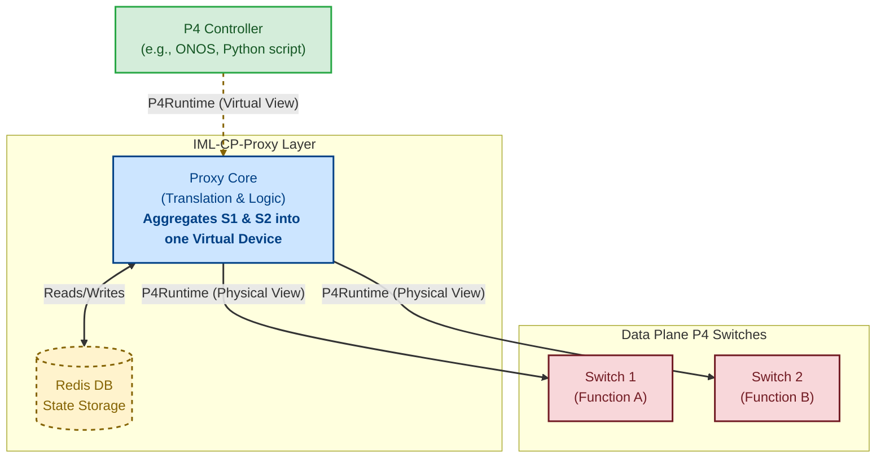

# IML-CP-Proxy
### P4Runtime-based Control Plane Proxy

[](https://www.repostatus.org/#wip)
[](https://github.com/DESIRE6G/IML-CP-Proxy/actions/workflows/ci.yml)

**IML-CP-Proxy** is a lightweight middleware that sits between a P4 Controller and your data plane. It allows you to **aggregate and disaggregate** P4 programs, merging multiple physical pipelines into a single virtual device (or vice versa). This simplifies control plane logic for complex, multi-switch topologies.

## Quick Start (Demo)

See the proxy in action immediately with our self-contained demo. This launches the Proxy, a simulated Switch, and a dummy Controller.

```bash
git clone [https://github.com/DESIRE6G/IML-CP-Proxy.git](https://github.com/DESIRE6G/IML-CP-Proxy.git)
cd IML-CP-Proxy
./run_demo.sh
```

- The script starts the full stack (Proxy, Redis, Switch, Controller).
- It automatically backs up any existing proxy_config.json you have.


## Production usage

To use IML-CP-Proxy with your own hardware and controller:

1) Configure: Copy the example config and edit it to match your physical switches.
```bash
cp example/proxy_config.json proxy_config.json
nano proxy_config.json
```
2) Run: Start only the Proxy and Redis (without the demo components). 
```bash
docker-compose up -d
```

3) Connect
- Point your P4 Controller to the correct port configured in proxy_config.json (e.g.: localhost:60051)
- The Proxy will route and transform requests to the switches defined in your config.

## Architecture

The proxy acts as a translation layer. It presents a "Virtual Device" to the controller(s), while managing the complexity of routing flow entries to the correct physical switches (S1, S2, etc.) in the background.



**Key Features**
- Virtualization: Merges distinct P4 pipelines (e.g., L2FWD + Firewall) into one logical view.
- Transparent Proxy: Uses standard P4Runtime gRPC; no changes needed on the Controller side.
- State Management: Uses Redis to track flow rule mappings and device states.

## Manual installation

```bash
pip3 install --upgrade pip
python3 -m pip install --upgrade setuptools
sudo apt-get install python3-dev
pip3 install --no-cache-dir --force-reinstall -Iv grpcio==1.65.5
```


## JSON Usage

The proxy can be configured via a JSON file. 
In this file, you can specify mutiple mappings that configure the operation of the proxy. 
A mapping contains targets and sources nodes to which we want to apply the proxy. 
If we have multiple source and one target we will aggregate several basic functions into this node. 
If we have multiple targets and one source then we will disaggregate the P4 program.
It also includes the corresponding P4 file and the connection data of the GRPC server. 
The proxy will connect to it and appear as a controller for the data plane.
In addition to the target, we must specify the mapping sources and the corresponding p4 files, these sources are the functions which we want to combine. 
In the case of sources, we also specify a prefix that has to be added to the beginning of the entity names in the merged P4 file, so we can avoid name conflicts in the case of the aggregated P4 file.

## Example

One of the most basic example configurations that combines 2 functions onto one target node is shown below. The table name ipv4_lpm in the function1.p4 file should appear as NF1_ipv4_lpm in the aggregated.p4 file.

```JSON
{
  "redis": "READWRITE",
  "mappings": [
    {
      "target": {
        "program_name": "aggregated",
        "port": 50051,
        "device_id": 0
      },
      "sources": [
        {
          "program_name": "function1",
          "prefix": "NF1_",
          "port": 60051
        },
        {
          "program_name": "function2",
          "prefix": "NF2_",
          "port": 60052
        }
      ]
    }
  ]
}
```

In this case, when the proxy receives from the controller of the function1 program for the ipv4_lpm table a table entry insert, the proxy receives a unique key in the message that identifies the table. This identifier is resolved by the proxy based on the p4info file generated from the function1.p4 file (function1.p4info file). It resolves to MyIngress.ipv4_lpm. This full name will be prefixed by the proxy, as a result of which we will get the name MyIngress.NF1_ipv4_lpm, which will finally be converted into an identifier based on the aggregated.p4info file. We do the same conversion for the actions of the table insert entry and with the new identifiers obtained in this way, we generate the new message, which we can now send to the node running the aggregated P4 program.

In production the typical mode is used for Redis is `READWRITE`, but for testing purpose there are different modes:

| Key        | Effect                                                              |
|------------|---------------------------------------------------------------------|
| READWRITE  | Reads entries from redis and write updates it on change             |
| ONLY_WRITE | Does not read on startup, but update                                |
| ONLY_READ  | Only load entries from redis on startup, but do not save any change |
| OFF        | Do not use redis entirely                                           |

The configuration can accept `source` for one source, `sources` for mutliple sources. `target` and `targets` similarly handled.

For fully detailed paraméters, you can find `ProxyConfig` Pydantic model in proxy.py that determines the structure of the configuration files or you can find multiple testcases in the repository.

### Preload

The proxy can help you to preload entries in the dataplane on startup. 
For that you can check the `preload` examples in testcases.

## Use as lib

The Proxy can be used as a lib as well. 
You can directly create a Pydantic modell and pass it to the `start_servers_by_proxy_config` function.

If you need more detailed control on the tool, you can initiate the `ProxyServer` classes directly, check the source code for more information.

## Testing enviroment

The repository contains an automatic tester that run all the examples that can be generated. 
The testcase folder contains the main files for a test, but in the subtests we can create new folders that contains another files that can extend or overwrite the files the originates from the test folder.

After the test folder is built up in the `__temporary_test_folder` the redis is purged and if a `redis.json` is existing then uploads the content of that file.

When the redis and the files are in place the system creates a tmux and runs a mininet in it.
When it is ready it launches a proxy and a controller.py.

The basic testing is just start a ping from h1 to h2 node and check if it is going through.

If you add a `validator.py` into the folder in that case it will run after everything is running. 
That file can contain a code that connects to the proxy and requests information as a slave client and validate the end status of the test.
If that code exits with non-zero then the testcase fails.

If the testcase is failed the built testcase is reamins in the `__temporary_test_folder` folder that contains logs about the outputs of the tmux panes as well.

### Examples

Run all the test cases:

```python tester.py```

Run the l2fwd testcase without subtest:

```python tester.py l2fwd```

Run the l2fwd testcase simple_forward subtest:

```python tester.py l2fwd/simple_forward```

You can use asterix as wildcard for testcase and subtest as well:

```python tester.py */preload```

```python tester.py counter/*```

Build the `__temporary_test_folder` for the l2fwd testcase simple_forward subtest:

```python tester.py l2fwd/simple_forward```

Do a release into the `release` folder that contains all the necessary files to run the proxy without symlinks:

```python release```

Reload redis information for the actually built test folder:

```python prepare```

## Test config

If you add a `test_config.json` to the test case, you can configure the followings:

| Paramter name         | functionality                                                         | Defatult value      |
|-----------------------|-----------------------------------------------------------------------|---------------------|
| run_validator         | Determines if the tester run validator.py after the test case.        | true                |
| load_redis_json       | Determines if the tester fills up the redis from the redis.json file. | true                |
| start_controller      | Determines if the tester starts the controller.                       | true                |
| exact_ping_packet_num | Determines how many ping the tester will send to the h2 node.         | Run until a timeout |
| file_overrides        | You can give a dict that determines files to use.                     |                     |

To decrease redundancy there are `testcase_common` folder, that files are all copied to the test folder and with the `file_overrides` paramter we can use for example the defined topology there if we add the following config to our `test_config.json`.

```json
{
  "file_overrides": {
    "topology.json": "topology_h1_s1_h2.json"
  }
}
```

If you want to only extend or override some fields of the `test_config.json` placed into the test case folder, you can create a `test_case_extend.json`, that does not override fully the base config.
This feature is for further redundancy decrease.

##  Contributing

Pull requests are welcome! For major changes, please open an issue first to discuss what you would like to change.