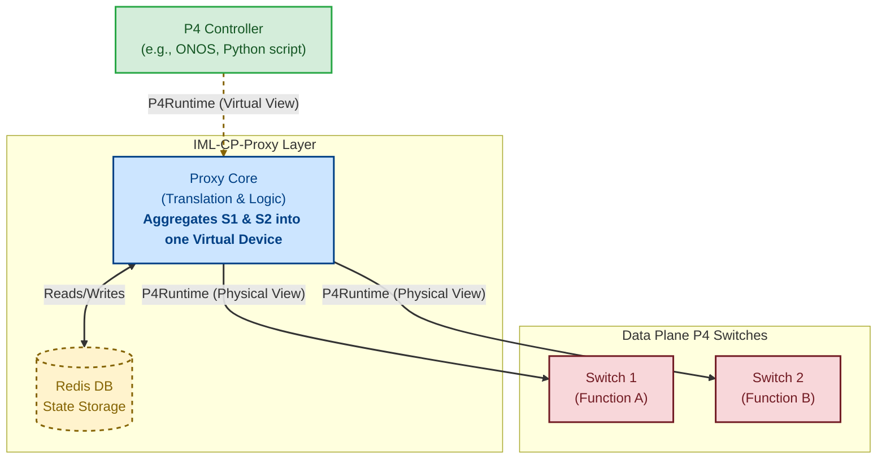

# IML-CP-Proxy
### P4Runtime-based Control Plane Proxy

[]()
[](https://github.com/DESIRE6G/IML-CP-Proxy/actions/workflows/ci.yml)
[](LICENSE)

**IML-CP-Proxy** is a lightweight middleware that sits between a P4 Controller and your data plane. It allows you to **aggregate and disaggregate** P4 programs, merging multiple physical pipelines into a single virtual device (or vice versa). This simplifies control plane logic for complex, multi-switch topologies.

## Quick Start (Demo)

See the proxy in action immediately with our self-contained demo. This launches the Proxy, a simulated Switch, and a dummy Controller.

```bash
git clone https://github.com/DESIRE6G/IML-CP-Proxy.git
cd IML-CP-Proxy
./run_demo.sh
```

- The script starts the full stack (Proxy, Redis, Switch, Controller).
- It automatically backs up any existing proxy_config.json you have.


## Production usage

To use IML-CP-Proxy with your own hardware and controller:

1) Configure: Copy the example config and edit it to match your physical switches.
```bash
cp example/proxy_config.json proxy_config.json
nano proxy_config.json
```
2) Customize: Change your proxy_config by your needs. Check the [configuration guide](docs/configuration.md) for details.
3) Run: Start only the Proxy and Redis (without the demo components). 
```bash
docker-compose up -d
```

3) Connect
- Point your P4 Controller to the correct port configured in proxy_config.json (e.g.: localhost:60051)
- The Proxy will route and transform requests to the switches defined in your config.

## Architecture

The proxy acts as a translation layer. It presents a "Virtual Device" to the controller(s), while managing the complexity of routing flow entries to the correct physical switches (S1, S2, etc.) in the background.



**Key Features**
- Virtualization: Merges distinct P4 pipelines (e.g., L2FWD + Firewall) into one logical view.
- Transparent Proxy: Uses standard P4Runtime gRPC; no changes needed on the Controller side.
- State Management: Uses Redis to track flow rule mappings and device states.

## Manual installation

1. Install dependencies:
```bash
pip3 install --upgrade pip
python3 -m pip install --upgrade setuptools
sudo apt-get install python3-dev
pip3 install --no-cache-dir --force-reinstall -Iv grpcio==1.65.5
```

## Manual installation on Mininet virtual machine

```bash
pip3 install --upgrade pip
python3 -m pip install --upgrade setuptools
sudo apt-get install python3-dev
pip3 install --no-cache-dir --force-reinstall -Iv grpcio==1.65.5
```

##  Contributing

Pull requests are welcome! For major changes, please open an issue first to discuss what you would like to change.

## License

Distributed under the Apache 2.0 License. See [LICENSE](LICENSE) for more information.
