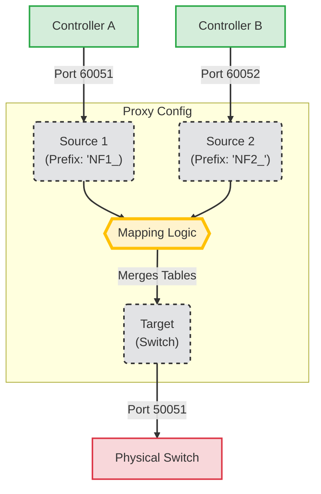
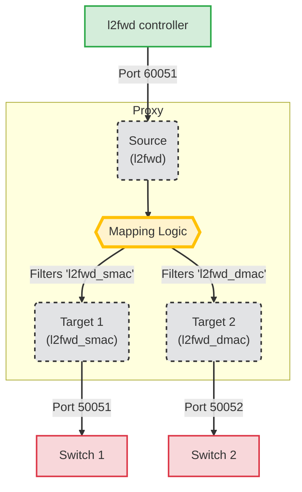

# IML-CP-Proxy Configuration Guide

The proxy can be configured via a JSON file. 
In this file, you can specify mutiple mappings that configure the operation of the proxy. 
A mapping contains targets and sources nodes to which we want to apply the proxy. 
If we have multiple source and one target we will aggregate several basic functions into this node. 
If we have multiple targets and one source then we will disaggregate the P4 program.
It also includes the corresponding P4 file and the connection data of the GRPC server. 
The proxy will connect to it and appear as a controller for the data plane.
In addition to the target, we must specify the mapping sources and the corresponding p4 files, these sources are the functions which we want to combine. 
In the case of sources, we also specify a prefix that has to be added to the beginning of the entity names in the merged P4 file, so we can avoid name conflicts in the case of the aggregated P4 file.

## Aggregation example (1 controller 2 switch)

One of the most basic example configurations that combines 2 network functions onto one target node is shown below. 
We have a function1.p4, a function2.p4 and an aggreagated version of these two named aggregated.p4.
The proxy prefixes the names, so the table name ipv4_lpm in the function1.p4 file should appear as NF1_ipv4_lpm in the aggregated.p4 file.
The prefix functionality is used to manage name conflicts among the source p4 files.

```JSON
{
  "redis": "READWRITE",
  "mappings": [
    {
      "target": {
        "program_name": "aggregated",
        "port": 50051,
        "device_id": 0
      },
      "sources": [
        {
          "program_name": "function1",
          "prefix": "NF1_",
          "port": 60051
        },
        {
          "program_name": "function2",
          "prefix": "NF2_",
          "port": 60052
        }
      ]
    }
  ]
}
```

In this case, when the proxy receives from the controller of the function1 program for the ipv4_lpm table a table entry insert, the proxy receives a unique key in the message that identifies the table. 
This identifier is resolved by the proxy based on the p4info file generated from the function1.p4 file (function1.p4info file). 
It resolves to MyIngress.ipv4_lpm. 
This full name will be prefixed by the proxy, as a result of which we will get the name MyIngress.NF1_ipv4_lpm, which will finally be converted into an identifier based on the aggregated.p4info file. 
We do the same conversion for the actions of the table insert entry and with the new identifiers obtained in this way, we generate the new message, which we can now send to the node running the aggregated P4 program.



## Disaggregation example (l2fwd)

For disaggregation scenarios, use the **targets** key (plural) to define a list of destination devices. 
Within each target, use the **names** dictionary to specify which P4 entities (tables, digests, counters, etc.) are routed to that specific device.

- Specific dict: Only the listed key entities are routed to this target. The names converted from key to value.
- Omitted: If names is missing, all entities are routed to this target.
- Empty dict ({}): If names is empty, no entities are routed.

```JSON
{
  "redis": "OFF",
  "mappings": [
    {
      "targets": [
        {
          "program_name": "l2fwd_smac",
          "port": 50051,
          "device_id": 0,
          "names": {
            "MyIngress.smac": "MyIngress.smac",
            "MyIngress.mac_learn": "MyIngress.mac_learn",
            "mac_learn_digest_t": "mac_learn_digest_t"
          }
        },
        {
          "program_name": "l2fwd_dmac",
          "port": 50052,
          "device_id": 1,
          "names": {
            "MyIngress.dmac": "MyIngress.dmac",
            "MyIngress.forward": "MyIngress.forward"
          }
        }
      ],
      "source": {
        "program_name": "l2fwd",
        "port": 60051
      }
    }
  ]
}
```



## Reference Table for JSON Configuration

### Main Configuration Object

| Field      | Type   | Description                                                                                          |
| :---       | :---   | :---                                                                                                 |
| `redis`    | String | **State Management Mode.** <br>`READWRITE` (Default): Syncs state to DB. <br>`OFF`: Disables Redis. <br>`ONLY_WRITE` / `ONLY_READ`: For testing. |
| `mappings` | List   | A list of proxy rules connecting Sources to Targets.                                                 |

---

### Mapping Object
*A mapping must have one side defined as singular (`target`/`source`) and the other as plural (`sources`/`targets`) or singular, depending on the scenario.*

| Field     | Type   | Description                                                                 |
| :---      | :---   | :---                                                                        |
| `target`  | Object | Single physical destination switch (Use for 1:1 or N:1 Aggregation).        |
| `targets` | List   | Multiple physical destination switches (Use for 1:N Disaggregation).        |
| `source`  | Object | Single logical controller interface (Use for 1:1 or 1:N Disaggregation).    |
| `sources` | List   | Multiple logical controller interfaces (Use for N:1 Aggregation).           |

---

### Target Fields
*Defines the physical device(s) the proxy connects to.*

| Field                      | Type   | Default | Description                                                                                                                                                                                          |
| :---                       | :---   | :---    |:-----------------------------------------------------------------------------------------------------------------------------------------------------------------------------------------------------|
| `program_name`             | String | *Req* | Used to locate the build artifacts. It needs only the name and will load the `./build/{program_name}.p4.p4info.txt` and `./build/{program_name}.json` files.                                         |
| `port`                     | Int    | *Req* | The gRPC port of the physical switch (e.g., `50051`).                                                                                                                                                |
| `device_id`                | Int    | *Req* | The P4Runtime Device ID required by the physical switch.                                                                                                                                             |
| `names`                    | Dict   | `None`  | **(Disaggregation only)** Filters or renames entities sent to this target.<br>`{"LogicName": "PhysName"}`.<br>If `None` (omitted), receives **all** entities.<br>If `{}` (empty), receives **none**. |
| `reset_dataplane`          | Bool   | `False` | If `true`, the proxy clears all table entries on the switch upon connection.                                                                                                                         |
| `rate_limit`               | Int    | `0`     | Maximum P4Runtime requests per second allowed to this target (0 = unlimited).                                                                                                                        |
| `rate_limiter_buffer_size` | Int    | `100`   | Size of the queue for pending requests if rate limit is exceeded.                                                                                                                                    |
| `batch_delay`              | Float  | `0.0`   | Time (seconds) to buffer write requests before sending them in a batch (improves throughput).                                                                                                        |

---

### Source Fields
*Defines the virtual interface(s) the Controller connects to.*

| Field          | Type   | Default | Description                                                                                                                        |
| :---           | :---   | :---    |:-----------------------------------------------------------------------------------------------------------------------------------|
| `program_name` | String | *Req* | Identifier for this logical source interface. Similarly working as in the target.                                                  |
| `port`         | Int    | *Req* | The gRPC port the **Proxy will listen on** for Controller connections.                                                             |
| `prefix`       | String | `""`    | **(Aggregation only)** String prepended to all P4 entity names (e.g., `FW_`) to prevent collisions when merging multiple programs. |

## Python Configuration (Using as a Library)

The Proxy can be used as a lib as well. 
You can directly create a Pydantic modell and pass it to the `start_servers_by_proxy_config` function.

If you need more detailed control on the tool, you can initiate the `ProxyServer` classes directly, check the source code for more information.

```python
from proxy import ProxyConfig, ProxyMapping, ProxyTarget, 
        ProxySource, start_servers_by_proxy_config

# 1. Define your Target (The Physical Switch)
target_switch = ProxyTarget(
    program_name="simple_switch",
    port=50051,
    device_id=1
)

# 2. Define your Source (The Virtual Interface for Controller)
controller_interface = ProxySource(
    program_name="simple_switch",
    port=60051,
    prefix="" # No prefix needed for simple forward proxy
)

# 3. Create the Config Object
config = ProxyConfig(
    redis="OFF", # or "READWRITE"
    mappings=[
        ProxyMapping(
            target=target_switch,
            source=controller_interface
        )
    ]
)

if __name__ == "__main__":
    print("Starting Proxy from Code...")
    start_servers_by_proxy_config(config)
```

### Preload

The proxy can help you to preload entries in the dataplane on startup. 
For that you can check the `preload` examples in testcases.
